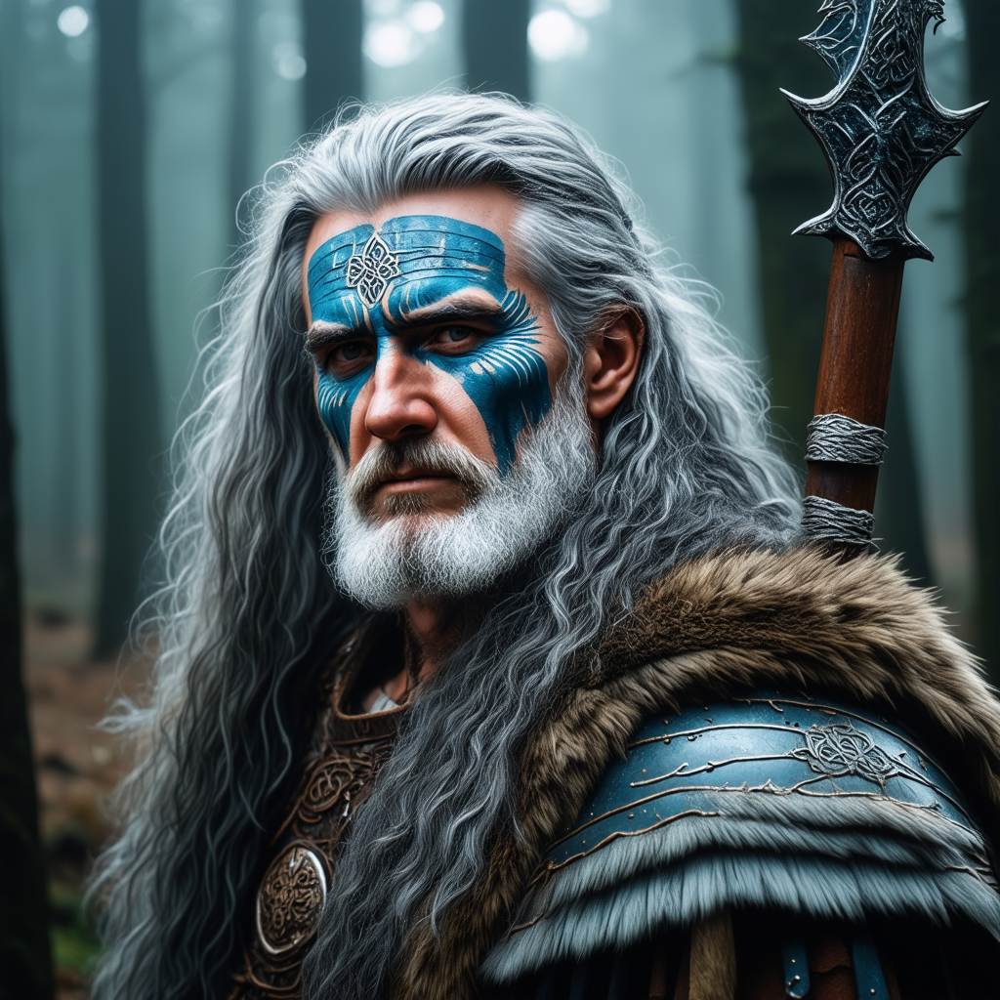

# GAN and Diffusion Models Implementation

This repository demonstrates a comprehensive exploration of generative models, focusing on both Generative Adversarial Networks (GANs) and Diffusion Models for high-quality image generation.

## Project Overview

This project implements and compares different state-of-the-art generative models with a focus on:
- Deep Convolutional GANs (DC-GANs)
- Conditional GANs (cGANs)
- Denoising Diffusion Probabilistic Models (DDPMs)
- Pre-trained Stable Diffusion models

Each implementation showcases the evolution of generative AI techniques and their capabilities for creating increasingly realistic and controllable images.

## Key Implementations

### 1. DC-GAN for MNIST Generation
- Custom implementation of Deep Convolutional GAN architecture
- Training visualization with generator/discriminator loss tracking
- Conditional generation to control specific digit outputs

### 2. Conditional GAN (cGAN)
- Pix2pix-style image-to-image translation framework
- U-Net generator with skip connections for better detail preservation
- PatchGAN discriminator for high-frequency structure evaluation
- Application: Facade generation from segmentation masks

### 3. Diffusion Models (DDPM)
- Implementation of denoising diffusion probabilistic models
- Progressive noise addition and denoising process
- UNet2DModel architecture with timestep embeddings
- Comparison of denoising steps (see `fantasy_landscape_5.png` vs `fantasy_landscape_40.png`)

### 4. Advanced Text-to-Image Generation
- Integration with StableDiffusion3.5 for text-prompted image creation
- Custom prompt engineering for creative image generation
- High-quality outputs for various domains (landscapes, portraits, cityscapes)

## Generated Images

| Image | Description |
|-------|-------------|
| [Fantasy Landscape (5 steps)](fantasy_landscape_5.png) | Fantasy landscape generated with just 5 denoising steps |
| [Fantasy Landscape (40 steps)](fantasy_landscape_40.png) | Same prompt with 40 denoising steps showing quality improvement |
| [Cyberpunk City](futuristic_cyberpunk_city.png) | Detailed futuristic cityscape with cyberpunk aesthetics |
| [Realistic Portrait](realistic_portrait.png) | Photorealistic human portrait generation |

## Technical Details

The complete implementation details, code, and training procedures can be found in the [GAN_and_Diffusion.ipynb](GAN_and_Diffusion.ipynb) notebook, which contains:
- Model architectures and hyperparameters
- Training loops and optimization techniques
- Visualization of generation processes
- Comparative analysis of different approaches

## Skills Demonstrated

- Deep understanding of multiple generative model architectures
- PyTorch implementation of complex neural networks
- Hyperparameter tuning for optimal generation quality
- Working with conditional inputs for controlled generation
- Integration with pre-trained diffusion models
- Image processing and quality evaluation

## Text Prompts

Custom text prompts used for the diffusion model generations can be found in [prompts.md](prompts.md).

Stevan Le Stanc