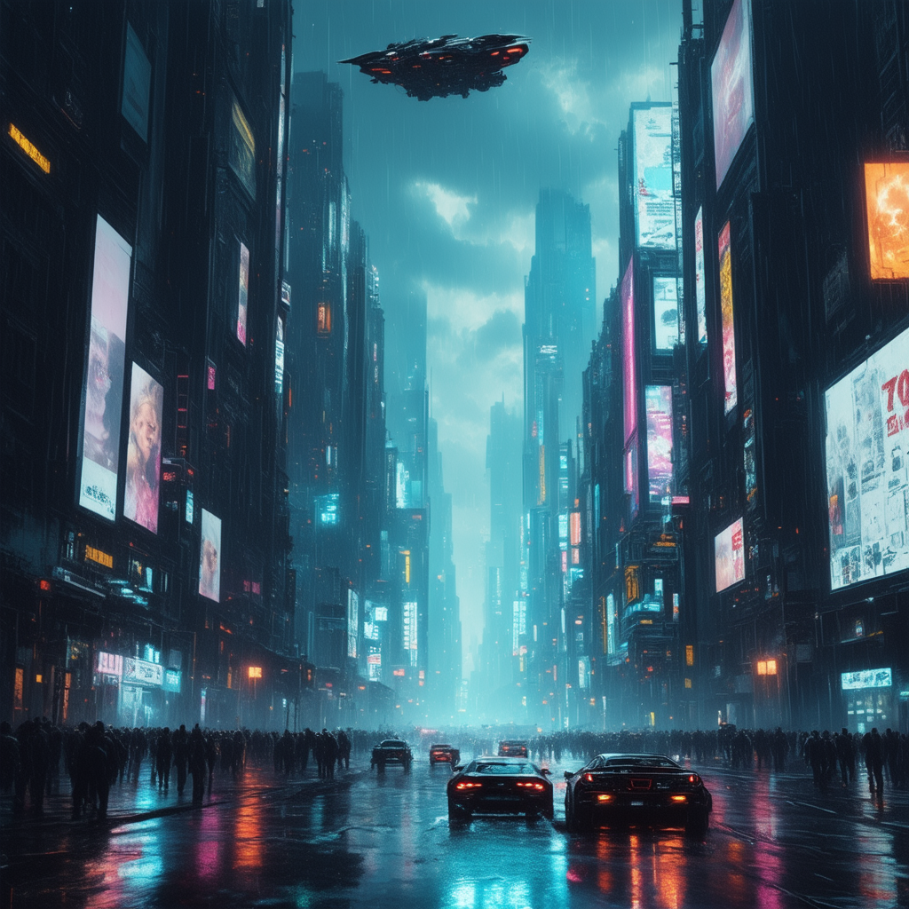
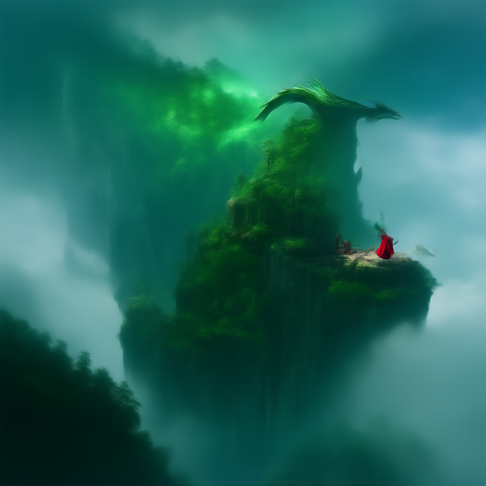
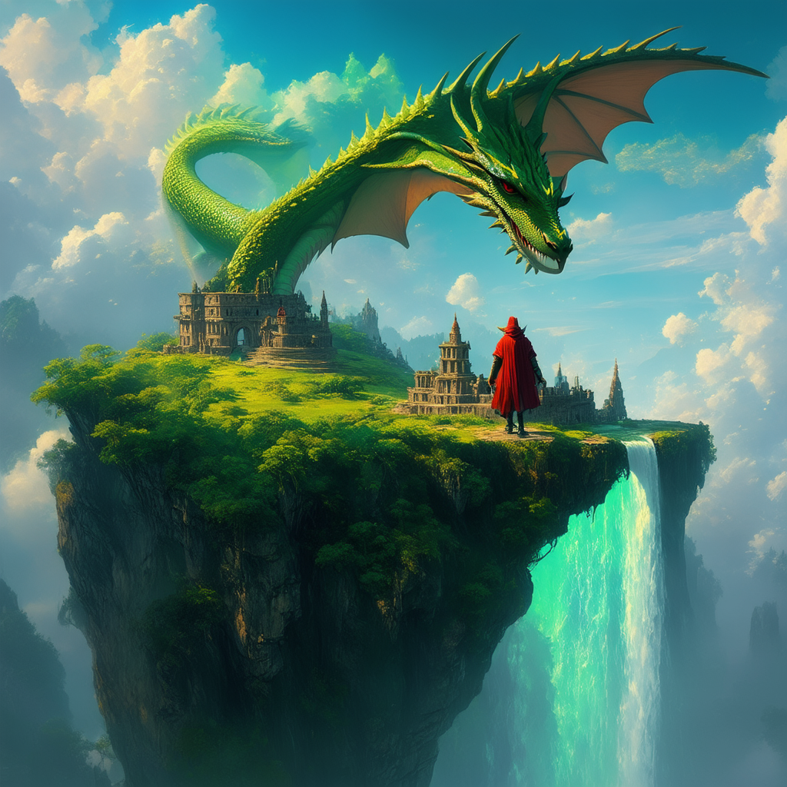

Here are the prompts I used for the 3 different images generated with stable-diffusion-3.5-medium.
Those prompts have been generated by chatGPT.

- realistic_portrait.png: "A hyper-realistic portrait of an elderly Celtic warrior with long silver hair, intricate blue war paint, and a weathered face. He wears a fur-lined cloak and holds a wooden staff, standing in a misty forest at dawn. The soft morning light highlights the texture of his skin and the details of his armor. Ultra-detailed, cinematic lighting, 8K resolution."

- futuristic_cyberpunk_city.png: "A sprawling cyberpunk metropolis at night, filled with neon lights reflecting off wet streets. Towering skyscrapers covered in holographic billboards, flying cars weaving through the sky, and cyborg pedestrians with glowing eyes. The scene has a moody, Blade Runner-inspired aesthetic with a dark, rainy atmosphere. Highly detailed, cyberpunk art style, neon color palette, cinematic composition."

- fantasy_landscape.png: "A floating island in the sky, covered in lush green forests and ancient ruins. A giant waterfall spills over the edge into the clouds below. A majestic dragon with shimmering emerald scales soars through the sky, while a lone adventurer in a red cloak stands on a cliff, gazing at the mystical scene. Epic fantasy art, breathtaking lighting, ultra-detailed, Studio Ghibli-inspired."

There are two versions for this one, one with 5 num_inference_steps (fantasy_landscape_5) and one with 40 (fantasy_landscape_40), leading to two imagew with different quality.

You can find the images in this repository too.